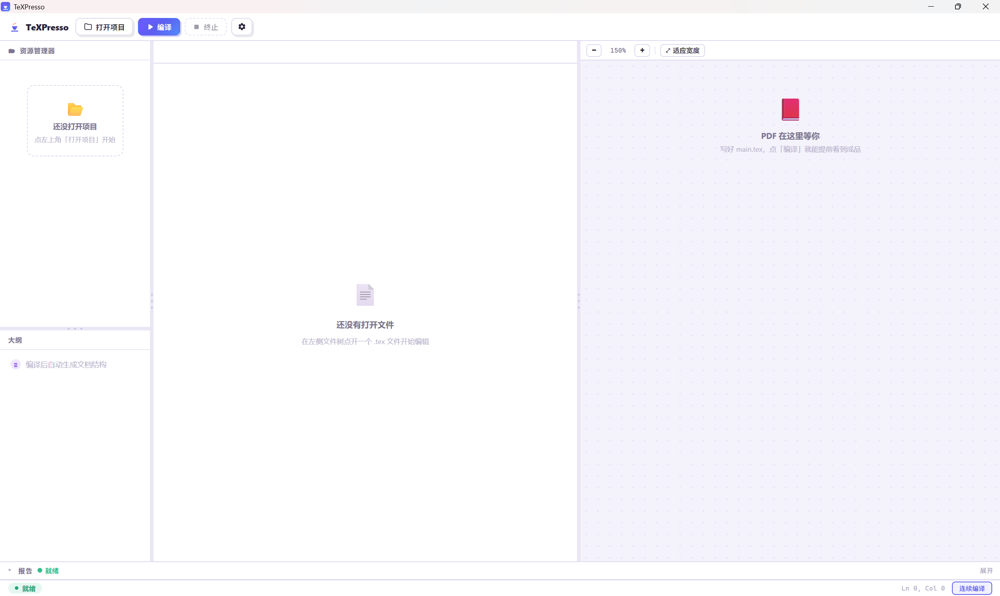

<div align="center">

# TeXPresso

**一杯浓缩咖啡的时间，实时编译出你的 LaTeX 成品**

打开含 `.tex` 的文件夹即可写作：编辑即编译，右侧 PDF 实时更新，并支持源码与 PDF 双向定位。

</div>

## 界面预览

TeXPresso 主界面：左侧文件树、中间编辑区、右侧 PDF 预览。



## 安装

依赖 **Windows 10/11**、Node.js ≥ 18、Rust（stable-x86_64-pc-windows-msvc，含 VS Build Tools C++ 工具链）及 **TeX Live 或 MiKTeX**（提供 `latexmk`/`xelatex`，缺失时应用会提示安装）。

```bash
npm install && npm run tauri dev
```

首次启动会编译 Rust（约几分钟），随后自动打开应用窗口。

## 快速开始

1. 启动应用，点「打开项目」，选择一个含 `.tex` 的文件夹（仓库内示例：`test_file/projects/multifile/`，多文件 + 跨文件引用结构）。
2. 编辑 `main.tex` → 自动编译 → 右侧 PDF 实时更新（首次自动「适应宽度」）。
3. `Ctrl+点击` 源码 → PDF 对应位置高亮；点击 PDF → 跳回源码。
4. 点「编译」手动编译；「⚙ 设置」调整引擎、编译模式、超时等。

## 实时编译

- **双模式触发**：**连续编译**（默认，输入停顿约 500ms 即编译，无需保存）+ **保存触发编译**，随时切换；另有手动「编译」按钮。
- **调度与失败语义**：合并队列（待编译只保留最新一条）、超时自动终止（默认 120s）、手动终止；超时与内容错误的重试策略不同。
- **错误列表**：解析 `.log`，同源去重/截断（错误雪崩不刷屏），点击跳转源码行。

> 说明：`latexmk`「增量」是对整份文档重跑一遍 xelatex 单遍（引擎特性），不跳过未改动文件；超大文档的单遍耗时可能超延迟预算，详见 [ADR-0005](./docs/adr/0005-latexmk-first-incremental-next.md)。

## 编辑与预览

- **编辑**：Monaco 编辑器 + 自研 LaTeX Monarch 语法高亮（Candy 配色），环境块折叠、多光标、代码片段（Tab 展开）、错误跳转。
- **预览**：pdf.js 内嵌连续分页（视口感知按需渲染），缩放（±/适应宽度/Ctrl+滚轮），高 DPI 渲染修复。
- **SyncTeX 双向定位**：`Ctrl+点击` 源码 → PDF 高亮；点击 PDF → 跳回源码。

## 项目与设置

- **文件夹即项目**：打开文件夹 → 文件树 → 多标签页；自动保存（防抖）+ 外部修改检测与冲突提示。
- **根文件**：正则启发式自动探测（含 `\documentclass` 的顶层 .tex），可手动覆盖。
- **设置**：引擎（XeLaTeX 默认，可切 LuaLaTeX/pdfLaTeX）、编译模式、防抖、超时、根文件覆盖；全局 + 项目（`.texpresso/settings.json`）两层，改即生效。

> 开发与设计细节（构建、测试、Roadmap 等）见 [docs/](./docs/) 与 [CONTEXT.md](./CONTEXT.md)。

## 许可

[MIT](./LICENSE) © 2026 WenqiBian
